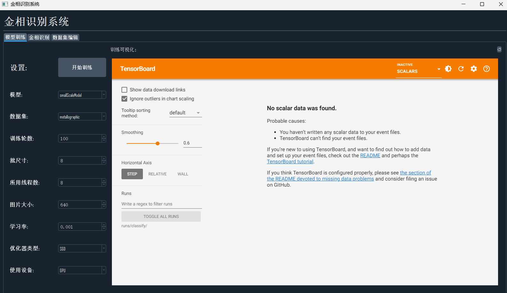
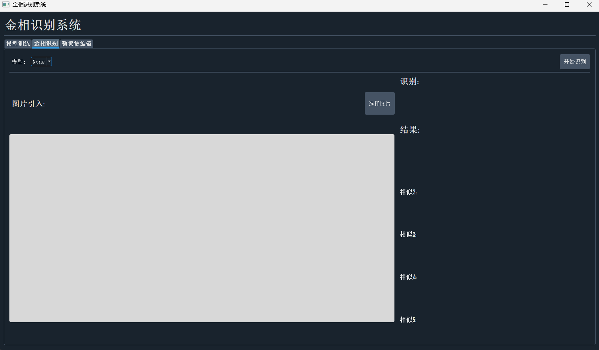
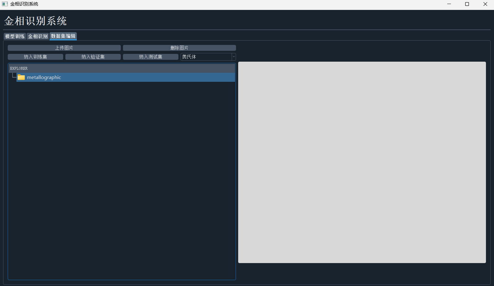

# 金相识别系统

一个基于深度学习的金相组织自动识别系统，使用YOLOv8分类模型进行金相图像的智能识别和分类。

## 项目概述

本系统是一个专业的金相分析工具，能够自动识别和分类不同类型的金相组织，包括奥氏体、贝氏体、马氏体、索氏体、铁素体等。系统采用PyQt5构建用户界面，集成了模型训练、图像识别和数据集管理功能。

## 主要功能

### 1. 模型训练
- 支持多种YOLOv8预训练模型（yolov8n-cls, yolov8s-cls, yolov8m-cls, yolov8l-cls, yolov8x-cls）
- 可配置训练参数：训练轮数、批尺寸、学习率、优化器类型等
- 支持GPU/CPU训练
- 集成TensorBoard可视化训练过程
- 自动保存最佳模型权重

### 2. 金相识别
- 支持单张图片识别
- 显示Top-5预测结果及置信度
- 实时图像预览
- 支持多种图像格式（PNG、JPG、BMP）

### 3. 数据集管理
- 可视化文件树浏览
- 图片上传和删除功能
- 支持将图片分类到训练集、验证集或测试集
- 支持的金相组织类型：
  - 奥氏体
  - 回火贝氏体
  - 回火马氏体
  - 回火索氏体
  - 铁素体+奥氏体
  - 铁素体+贝氏体
  - 铁素体+珠光体

## 技术架构

### 核心技术栈
- **深度学习框架**: PyTorch + Ultralytics YOLOv8
- **用户界面**: PyQt5
- **图像处理**: OpenCV, PIL
- **可视化**: TensorBoard
- **样式**: QDarkStyle

### 项目结构
```
金相识别系统/
├── main.py                 # 主程序入口
├── system.py              # 系统主逻辑
├── train.py               # 模型训练模块
├── detect.py              # 图像识别模块
├── utils.py               # 工具函数
├── style.qss              # 界面样式文件
├── requirements.txt       # 依赖包列表
├── ui/                    # 用户界面模块
│   ├── __init__.py
│   └── mainWindow.py      # 主窗口UI
├── datasets/              # 数据集目录
│   └── metallographic/    # 金相数据集
│       ├── train/         # 训练集
│       ├── val/           # 验证集
│       └── test/          # 测试集
├── runs/                  # 训练结果目录
│   ├── classify/          # 分类模型训练结果
│   └── detect/            # 检测结果
└── weights/               # 预训练模型权重
    ├── yolov8n-cls.pt
    ├── yolov8s-cls.pt
    ├── yolov8m-cls.pt
    ├── yolov8l-cls.pt
    └── yolov8x-cls.pt
```

## 安装说明

### 环境要求
- Python 3.8+
- CUDA 11.2+ (可选，用于GPU加速)
- Windows 10/11

### 安装步骤

1. **克隆项目**
```bash
git clone <项目地址>
cd 金相识别系统
```

2. **安装依赖**
```bash
pip install -r requirements.txt
```

3. **运行程序**
```bash
python main.py
```

## 界面展示

### 训练界面


### 识别界面


### 数据集管理界面


## 使用指南

### 1. 模型训练

1. 打开"模型训练"标签页
2. 配置训练参数：
   - 选择预训练模型
   - 设置训练轮数（默认100）
   - 设置批尺寸（默认8）
   - 设置学习率（默认0.01）
   - 选择优化器（SGD/Adam/RMSprop/Adamax）
   - 选择设备（GPU/CPU）
3. 点击"开始训练"按钮
4. 训练过程中可通过TensorBoard查看训练进度

### 2. 金相识别

1. 打开"金相识别"标签页
2. 选择已训练的模型
3. 点击"选择图片"按钮选择要识别的金相图像
4. 点击"开始识别"按钮
5. 查看Top-5识别结果及置信度

### 3. 数据集管理

1. 打开"数据集编辑"标签页
2. 使用文件树浏览数据集结构
3. 点击图片进行预览
4. 使用分类按钮将图片归类到相应数据集
5. 支持删除不需要的图片

## 数据集说明

### 数据集结构
```
datasets/metallographic/
├── train/          # 训练集
│   ├── 奥氏体/
│   ├── 贝氏体/
│   ├── 马氏体/
│   ├── 索氏体/
│   ├── 铁素体+奥氏体/
│   ├── 铁素体+贝氏体/
│   └── 铁素体+珠光体/
├── val/            # 验证集
└── test/           # 测试集
```

### 数据统计
- 训练集：约721张图片
- 验证集：约140张图片  
- 测试集：约300张图片
- 支持格式：JPG、PNG

## 模型性能

系统支持多种YOLOv8预训练模型，可根据需求选择：
- **yolov8n-cls**: 轻量级模型，速度快
- **yolov8s-cls**: 小型模型，平衡性能
- **yolov8m-cls**: 中型模型，较好精度
- **yolov8l-cls**: 大型模型，高精度
- **yolov8x-cls**: 超大型模型，最高精度

## 开发说明

### 主要模块

1. **System类** (`system.py`): 系统主控制器，管理UI交互和业务逻辑
2. **TrainThread类** (`train.py`): 模型训练线程，支持异步训练
3. **ClassifyThread类** (`detect.py`): 图像识别线程，支持异步识别
4. **UI模块** (`ui/mainWindow.py`): PyQt5界面定义

### 扩展开发

如需添加新的金相组织类型：
1. 在`ui/mainWindow.py`中的`comboBox_calibration`添加新选项
2. 在数据集目录中创建对应的文件夹
3. 重新训练模型

## 注意事项

1. 首次运行需要下载预训练模型权重
2. GPU训练需要安装CUDA和cuDNN
3. 训练过程中请确保有足够的磁盘空间
4. 建议使用GPU进行训练以提高效率

## 许可证

本项目仅供学习和研究使用。

## 联系方式

如有问题或建议，请联系开发团队。

---

*最后更新：2024年*
